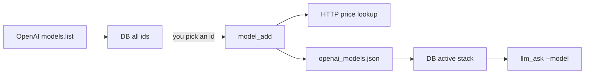

# Auto-add models to the curated stack

## What you had wrong vs what you want

The **DB** is already the “see everything” list (`model_sync` stored ~100 extra ids as **inactive**). That is how you discover candidates.

The **JSON** is the **active stack** (priced, `endpoint_kind`, allowed on `llm_ask`). Today those three rows were typed once. You want: pick an id from the inventory → a **command** fills prices and promotes it onto the stack.

Switching on the fly stays: `llm_ask --model <id>` among **active** rows. Adding to the stack is the new step.



## Constraint (honest)

OpenAI still has **no official prices API**. A command cannot “web-search like the agent.” It **HTTP-fetches a machine-readable table** (unofficial but stable), not ChatGPT-style browsing.

**Lookup source (v1):** [LiteLLM `model_prices_and_context_window.json`](https://raw.githubusercontent.com/BerriAI/litellm/main/model_prices_and_context_window.json) — keys like `openai/gpt-5-mini` with `input_cost_per_token` / `output_cost_per_token`. Convert to per-1M for our file.

If the id is missing there: **fail clearly**; allow `--input-cost-per-1m` and `--output-cost-per-1m` so you can still add without a lookup.

`endpoint_kind`: heuristic in [`request/services.py`](request/services.py) (`o1`/`o3`/`o4`/`gpt-5` reasoning-style → `responses`; else `chat_completions`), overridable with `--endpoint-kind`.

## Command

`python manage.py model_add --model gpt-5-mini [--json] [--default]`

Optional: `--input-cost-per-1m`, `--output-cost-per-1m`, `--endpoint-kind`.

**Service** `add_model_to_stack(model_id, ...)` in [`request/services.py`](request/services.py):

1. Reject non-text ids (existing `is_non_text_model_id`).
2. Prefer that the id already exists in DB from `model_sync` (warn if not on `models.list`).
3. Fetch prices (or use flags).
4. Insert/update the object in [`request/catalog/openai_models.json`](request/catalog/openai_models.json) (keep `_comment` and other models). If `--default`, clear other `is_default`.
5. Run existing `sync_model_catalog()` so the row becomes **active** with prices.

Thin wrapper: [`request/management/commands/model_add.py`](request/management/commands/model_add.py).

**Do not** scrape OpenAI HTML in v1 (brittle). Document the LiteLLM URL in [`request/README.md`](request/README.md).

## Everyday use

```bash
.venv/bin/python manage.py model_list --all --json   # browse inventory
.venv/bin/python manage.py model_add --model gpt-5-mini --json
.venv/bin/python manage.py llm_ask --prompt "..." --model gpt-5-mini --json
```

Agents call the same `model_add` command (no extra Cursor skill in this pass).

## Tests and docs

- Unit: parse LiteLLM-shaped JSON → per-1M; write JSON fixture; heuristic `endpoint_kind`.
- Integration: `call_command("model_add", ...)` with mocked HTTP.
- [`AGENTS.md`](AGENTS.md): document `model_add`.
- [`docs/project-plan.md`](docs/project-plan.md): checklist item.

Network: `urllib` stdlib GET; no new dependency unless tests need a mock (use `unittest.mock`).
