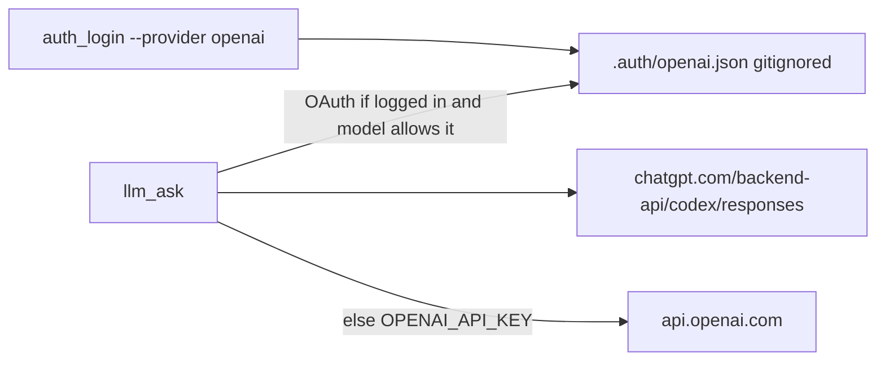

# ChatGPT OAuth for llm_ask

## Advice (the choice)

OpenAI does not sell Plus/Go as Platform API credit. The working path (Codex CLI, OpenClaw, Pi) is: **sign in with ChatGPT**, then call the **Codex backend**, not `api.openai.com`.

Three ways to do that:

- **Borrow Codex’s login** — install Codex, run `codex login`, we reuse `~/.codex/auth.json`. Less code, but you need another tool, and sharing that file can log one of you out when tokens refresh.
- **Our own login (recommended)** — `manage.py auth_login` opens a browser, we store tokens ourselves. Fits this repo’s command pattern, no Codex install, no fight over Codex’s file.
- **Ask Codex to answer every prompt** — shell out to `codex exec`. Closest to what OpenAI documents, but Codex is a coding agent, not a clean one-shot API. Poor fit for `llm_ask`.

**We will do our own login.** Same unofficial Codex backend OpenClaw uses. OpenAI has not published a third-party contract; it can break. Default model `gpt-4o-mini` stays on the API key. Subscription calls use a Responses-style Codex model (you already have `gpt-5.6-terra`).



## Provider-shaped now, Anthropic later (not this slice)

`LLMModel` already has `provider`. Auth should match that so a later Anthropic pass is `--provider anthropic`, not a rename.

- Commands take `--provider` (default `openai`). v1 implements **only** `openai`. Any other id fails with a clear “not implemented” (no Anthropic login/code).
- Token files: gitignored [`.auth/<provider>.json`](.auth/openai.json) (directory `.auth/`). OpenAI refresh writes `.auth/openai.json`. Anthropic would be `.auth/anthropic.json` later — do not share one blob.
- Do **not** add Anthropic catalogs, env keys, or CLI reuse in this slice.

## v1 behaviour

- New commands (thin wrappers over `request/services.py`, `--json` on list/show/status):
  - [`auth_login`](request/management/commands/) — `--provider openai` (default). PKCE at `https://auth.openai.com/oauth/authorize`, local callback (port other than Codex’s 1455, e.g. 8765), exchange at `https://auth.openai.com/oauth/token`, save tokens. **Once**, like Pi: stay signed in.
  - [`auth_status`](request/management/commands/) — `--provider openai` (default). Logged in / expired / plan if present in the JWT. **Never print tokens.**
  - **No `auth_logout` in v1.** A Pi-style continuous agent never logs off. Continuity is **token refresh on use**. To stop using OpenAI OAuth later, delete `.auth/openai.json`.
- Do not reuse `~/.codex/auth.json`.
- [`complete_single_turn`](request/services.py): new `auth_mode` `auto` | `oauth` | `api_key` (default `auto`).
  - `oauth` / `auto`+logged-in: OpenAI client with `base_url=https://chatgpt.com/backend-api/codex`, Bearer access token, `ChatGPT-Account-ID` from the JWT, `OpenAI-Beta: responses=experimental`, `originator: my_agent_v1` (do not pretend to be `codex_cli_rs`). Refresh if expired; 401 → refresh once → retry.
  - Otherwise: today’s `OPENAI_API_KEY` path.
- Model gate: OAuth is **Responses-only**. `chat_completions` models (e.g. `gpt-4o-mini`) refuse OAuth with a clear error: use `--model gpt-5.6-terra` or `--auth api_key`. Optional catalog flag `supports_codex_oauth` on [`openai_models.json`](request/catalog/openai_models.json) for `gpt-5.6-terra` (and later ids).
- [`llm_ask`](request/management/commands/llm_ask.py): add `--auth`. JSON envelope includes `auth_mode` (`oauth` | `api_key`). `estimated_cost_usd` is `null` on OAuth (quota, not API USD).
- Device-code login: **not in this slice** (add later if headless is needed).
- Do **not** scrape chatgpt.com as a ChatGPT website fake API.

PKCE/token helpers can live in [`request/oauth.py`](request/oauth.py) so [`request/services.py`](request/services.py) stays the public surface commands call. Prefer stdlib (`urllib`, `http.server`, `hashlib`, `secrets`); no new dependency unless tests need it.

OAuth client id is the public Codex CLI id (`app_EMoamEEZ73f0CkXaXp7hrann`) — there is no separate third-party app. Document that in [`request/README.md`](request/README.md).

## Tests and docs

- Unit: PKCE challenge shape; JWT account-id extract; refresh persist; `complete_single_turn` picks OAuth vs API key; OAuth rejected for `chat_completions`.
- Integration: `call_command("auth_status"|"llm_ask")` with a temp token file and mocked HTTP. No live OpenAI/OAuth in CI.
- Gitignore `.auth/`. Mention in [`.env.example`](.env.example) / [`AGENTS.md`](AGENTS.md) / [`request/README.md`](request/README.md) / [`docs/project-plan.md`](docs/project-plan.md). Tick the ChatGPT subscription item only after this works. **User confirmed:** append a later (unchecked) Anthropic item — Claude API key plus optional Claude CLI / subscription auth — do not implement it in this slice.

## Everyday use (after)

```bash
.venv/bin/python manage.py auth_login --provider openai --json   # once; --provider defaults to openai
.venv/bin/python manage.py auth_status --provider openai --json
.venv/bin/python manage.py llm_ask --prompt "why is the sky blue?" --model gpt-5.6-terra --json
.venv/bin/python manage.py llm_ask --prompt "..." --auth api_key --json
```
