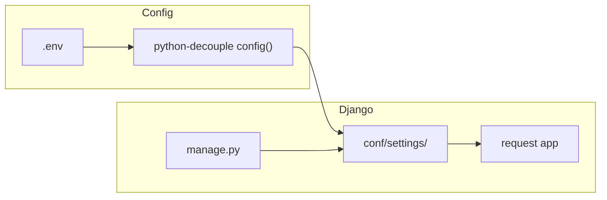

# Django chatbot project bootstrap

## Current state

[`/home/pmpmt/python/260925-my_agent/my_agent_v1`](/home/pmpmt/python/260925-my_agent/my_agent_v1) is **empty**. No code, git metadata, or venv yet.

## Conventions (aligned with your other Django repos)

Mirror patterns from [`fri-uni_v2`](file:///home/pmpmt/python/260908-fri-uni/fri-uni_v2): project package **`conf/`**, split settings, `manage.py` driven by `DJANGO_SETTINGS_MODULE` from `.env`, SQLite by default, pytest via `pytest.ini`.



## Target layout

```text
my_agent_v1/
├── .cursor/
│   ├── README.md
│   ├── cli.json
│   ├── hooks.json
│   ├── hooks/          (.gitkeep)
│   ├── plans/          (.gitkeep)
│   ├── agents/         (.gitkeep)
│   ├── commands/
│   │   └── session-handoff.md
│   ├── rules/
│   │   ├── core.mdc
│   │   └── django-python.mdc
│   └── skills/
│       └── session-handoff/SKILL.md
├── AGENTS.md
├── .env                  (local, gitignored — placeholders)
├── .env.example          (committed template)
├── .gitignore
├── requirements.txt
├── pytest.ini
├── manage.py
├── conf/
│   ├── __init__.py
│   ├── urls.py
│   ├── wsgi.py
│   ├── asgi.py
│   └── settings/
│       ├── base.py
│       ├── dev.py
│       ├── test.py
│       └── prod.py       (minimal stub)
├── request/              (empty app: models/views/urls/admin only defaults)
│   └── tests/
│       └── test_smoke.py
└── docs/
    ├── handoff.md
    └── project-plan.md   (minimal stubs for session-handoff skill)
```

**Phase 1 (this work):** skeleton only — register `request` in `INSTALLED_APPS`, root URL includes nothing app-specific yet (or a harmless health route under `conf/urls.py` only if useful for smoke tests).

**Phase 2 (later, not in this pass):** add `djangorestframework`, API views on `request`, OpenAI client in a `request/services.py` layer.

## Dependencies — [`requirements.txt`](requirements.txt)

| Package | Purpose |
|---------|---------|
| `Django>=5.0,<6` | Web framework |
| `python-decouple>=3.8` | Read `.env` / env vars (`from decouple import config`) |
| `openai>=1.66.0` | Official OpenAI SDK (ready for phase 2; no usage code yet) |
| `pytest>=8.0` | Test runner |
| `pytest-django>=4.8` | Django pytest integration |

Comment in `requirements.txt`: install **`python-decouple`**, not the unrelated PyPI package `decouple`.

## Environment files

**[`.env.example`](.env.example)** (committed):

- `DJANGO_SETTINGS_MODULE=conf.settings.dev`
- `DJANGO_SECRET_KEY=` (document: generate for local use)
- `ALLOWED_HOSTS=localhost,127.0.0.1`
- `OPENAI_API_KEY=`
- `OPENAI_MODEL=gpt-4o-mini` (optional default model name for later)

**[`.env`](.env)** (created locally, listed in `.gitignore`): same keys with empty/placeholder values so `decouple` works out of the box after `cp .env.example .env`.

**Settings wiring** in [`conf/settings/base.py`](conf/settings/base.py):

```python
from decouple import config

OPENAI_API_KEY = config("OPENAI_API_KEY", default="")
OPENAI_MODEL = config("OPENAI_MODEL", default="gpt-4o-mini")
```

`dev.py` loads `SECRET_KEY` and `ALLOWED_HOSTS` from env (same pattern as fri-uni). `test.py` imports `dev`, sets fast password hasher. `prod.py` stub with `DEBUG=False` and required env vars documented.

**[`manage.py`](manage.py):** if `"test"` in argv → `conf.settings.test`; else `config("DJANGO_SETTINGS_MODULE", default="conf.settings.dev")`.

## Testing

**[`pytest.ini`](pytest.ini):**

```ini
[pytest]
DJANGO_SETTINGS_MODULE = conf.settings.test
python_files = tests.py test_*.py *_tests.py
```

**[`request/tests/test_smoke.py`](request/tests/test_smoke.py):** one test asserting Django loads settings and `OPENAI_*` settings exist (no network, no real API key).

Run after setup: `.venv/bin/pytest` and `.venv/bin/python manage.py check`.

## [`.gitignore`](.gitignore)

Copy the standard set from fri-uni: `.env`, `.env.*` with `!.env.example`, `.venv/`, Python caches, Django `db.sqlite3` / `media/` / `staticfiles/`, pytest/coverage caches, IDE/OS junk.

## `.cursor/` project config

Follow the documented layout in [`fri-uni_v2/.cursor/README.md`](file:///home/pmpmt/python/260908-fri-uni/fri-uni_v2/.cursor/README.md):

- **`rules/core.mdc`**: always-on agreements (minimize scope, no secrets in repo, no emoji in logs, do not edit `.cursor/plans/` unless asked) tailored to this chatbot repo.
- **`rules/django-python.mdc`**: layering `views → services.py → models`, `conf/settings/` split, `.venv/bin/python` for manage/pytest.
- **`skills/session-handoff/`** + **`commands/session-handoff.md`**: adapted to this repo’s `docs/handoff.md`, `docs/project-plan.md`, and `AGENTS.md` (no fri-uni domain docs).
- **`hooks.json`**: `{ "version": 1, "hooks": {} }`
- **`cli.json`**: `{}`
- Empty **`plans/`**, **`agents/`**, **`hooks/`** with `.gitkeep` so folders exist in git.

## [`AGENTS.md`](AGENTS.md)

Short root agent brief: stack (Django 5, decouple, OpenAI env vars, pytest), layout (`conf/`, `request/`), phase 1 vs phase 2 (DRF later), essential commands (`cp .env.example .env`, `migrate`, `runserver`, `pytest`).

## Setup commands (after files are written)

Execute in project root:

```bash
python3 -m venv .venv
.venv/bin/pip install -U pip
.venv/bin/pip install -r requirements.txt
.venv/bin/python manage.py migrate
.venv/bin/python manage.py check
.venv/bin/pytest
```

Optional: `git init` only if you want a repo immediately (not requested unless you ask).

## Out of scope (phase 2)

- `djangorestframework`, serializers, chatbot API endpoints on `request`
- OpenAI call implementation in `request/services.py`
- Channels/WebSockets, auth, conversation models
- Production deploy (gunicorn, Postgres, whitenoise)
